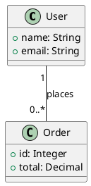

# UML example

A simple class diagram:

```plantuml
@startuml
class User {
  +name: String
  +email: String
}

class Order {
  +id: Integer
  +total: Decimal
}

User "1" -- "0..*" Order : places
@enduml
```
